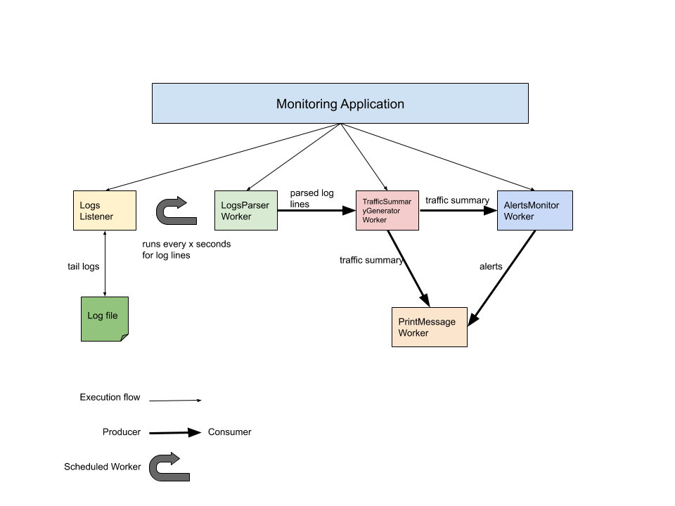

# Datadog Logs Monitoring App

This app listens/tails the access logs from a location like `/tmp/access.log` and generates statistics and alerts for the traffic.

## Requirements
* maven
* java runtime environment 11

## Installation
The below command will install all the necessary libraries required for the app to run.

`mvn install`

## Test

`mvn test`

## Execution

Runs the app with default configuration:

`./run.sh`

For e.g. to run with custom log location:

`./run.sh -f /var/access.log`

To see all configuration options:

`./run.sh --help`

## Logging

The application during its execution logs information from logging levels ranging from `TRACE` to `ERROR` in `application.log` file in the project root.

## Application Design



* The application is composed of several workers which are started by the main class i.e. `MonitoringApplication`. 
* Each worker is based on `single responsibility` principle.
* The workers are connected by unbounded FIFO queues (represented by thick arrow). The work output of a worker can be handed to the next worker in the sequence.
* Workers which operate in a sequence act as `producer` & `consumer` respectively for e.g. `LogsParserWorker` is a producer which gives parsed logs to the `TrafficSummaryGeneratorWorker`.
* If a worker's output need to be displayed to the user they use the `PrintMessageWorker` which currently simple logs to the console.

## Fault tolerance

* Any sort of exceptions which can occur are caught and logged.
* Each worker running is as a separate thread and if any thread terminates due to a failure during execution prior to shutdown, a new one will take its place if needed to execute subsequent tasks.

## Availability

The application will keep running unless the user quits the application.

## Improvements

* Building a nice UI to show the traffic summary and alerts, currently everything goes to the console and you need to scroll to see any previous alerts which were active or recovered.
* Implementing more log formats like `Combined Log Format`, `Extended Log File Format` etc. but any new format can be added easily by implementing the  `LogsParser` interface.
* Adding more alert monitors for e.g. `LowTrafficAlertsMonitor` when the traffic drops below a specific moving average.
* There is no persistance for the traffic summary and alerts we are generating. Connecting to a high throughput datastore like `Cassandra` will be good.

## Sample output

```
****** Traffic stats  ******
Total requests served: 11
Total content size: 54 KB
Top 5 sections by hits:
	app -> 2
	search -> 2
	list -> 2
	posts -> 2
	wp-admin -> 2
HTTP Methods by hits:
	DELETE -> 2
	GET -> 9
****** End of traffic stats ******

!!! A High traffic alert is now Active !!!
```